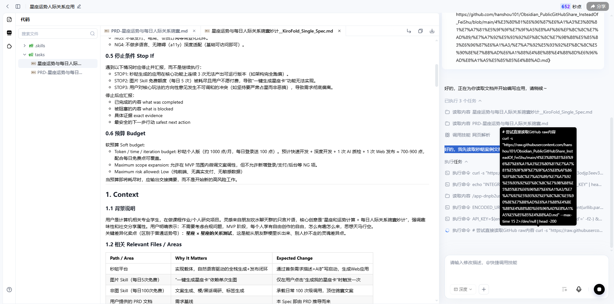

# 【摸鱼大王】豆包+工作流+秒哒，快速复刻爆款

定位：
- 兴趣使然。乐趣。
- 纯好玩
- 登山者
- 浮夸
- 思考的节奏
	- 其疾如风、    （见  08月09日  笔记）
		- 叩击
- 1
	- 军事家    岳飞    “运用之妙，存乎一心”
		- 1
- 完成个人介绍：
	- Opus5，去优化————看怎么制作？
- 讲述材料
	- 需要什么skill  ？

- 自我检查项：
	- 已有的
		- 随口    头脑风暴    一下。
			- 展示一下，该应用。
	- 新想到    待确定的
		- GitHub链接，豆包能访问吗？秒哒能访问吗？阿里灵光能访问吗？
			- 对话Agent
				- （之前用的GPT，当然可以访问）
				- 豆包
					- 已经确认，GitHub链接    专业版豆包可以访问（额度极其有限，很快就用完了）；   快速版豆包无法访问（第一次它没意识到，第二次它直说没能力。）
				- qwen3.8 Max 快速版：
					- 不能访问链接。
						- `  Wait, the tools I have are "联网搜索 (web search)" and "当前时间 (current time)". I don't have a tool to directly read URLs. Hmm. Let me think about how to handle this.  `
				- 腾讯元宝：
					- 使用【超级元宝】吧！
						- ————但是要注意，不能【放入分组】————这个是冲突。
							- 1111
					- （不太稳定——经常也不去深度思考）Hy3模型+深度思考————可以访问GitHub链接。
						- Nice
					- 2、DeepSeek模型+深度思考————可以访问GitHub链接。
						- Nice
					- 对比一下：
						- Hy3似乎聪明一点？  Hy3还能出【MD文档】
						- DeepSeek给了一些【过于小众】的“星座牢房”梗  ——  初看有点莫名其妙？
			- 秒哒
				- 一般会显示：【调用技能    网页解析    好的，我先读取秒哒案例文档，再调用 PRDAgent 生成正式 PRD。    】
				- 图：
					- `    # 尝试直接读取GitHub raw内容 curl -s "https://raw.githubusercontent.com/hanshou101/……………………    `
						- 
			- 阿里灵光
				- （GLM-5.1  模型下）
					- 发现——默认无法访问【GitHub链接】；只能访问    上传的PRD文件、Spec文件。

- 试验案例
	- （第一版，完全国产免费产品）踩坑
		- 元宝对话
			- "星座运势MVP开发需求"点击查看元宝的回答    https://yb.tencent.com/s/5wy5MMvuXyet
		- 秒哒（改了3版，都已加入到    最新经验    ）
			- 秒哒-无代码应用搭建平台，一句话做应用    https://www.miaoda.cn/projects/app-dnpb2us54su9?previousPage=%2F
		- 灵光
			- 灵光AI-蚂蚁旗下智能全模态AI助手    https://www.lingguang.com/chat?id=2d10b42c-e69a-4d38-be54-24463d542351
	- 第一版似乎过于简单，体现不出实力：
		- ————我们，去效仿一些产品吧
			- 调研：
				- 1
		- 1
		- 2
		- 3
		- 4
		- 5
		- 6
		- 7
		- 8
		- 9
		- 10

# 

# 

# 
