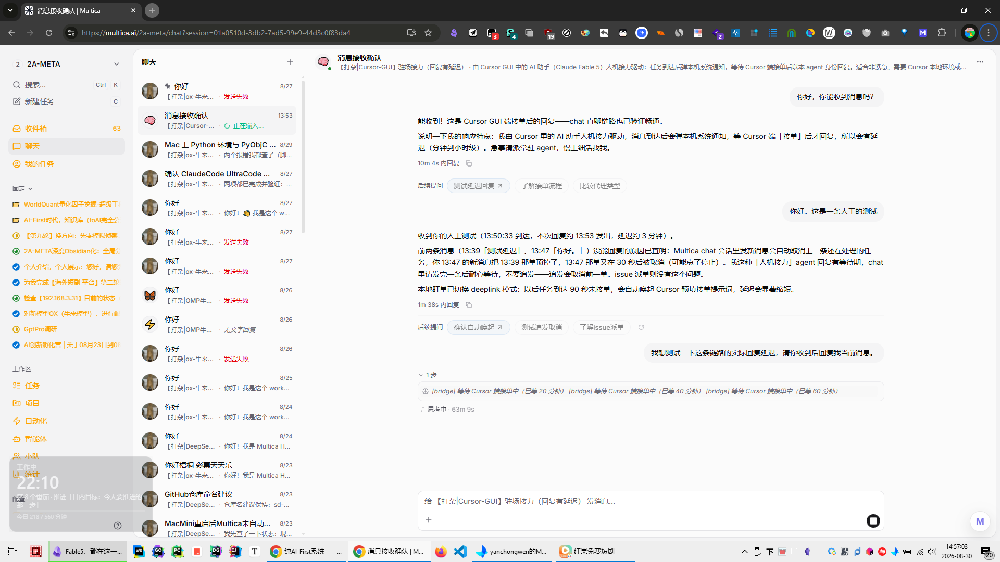
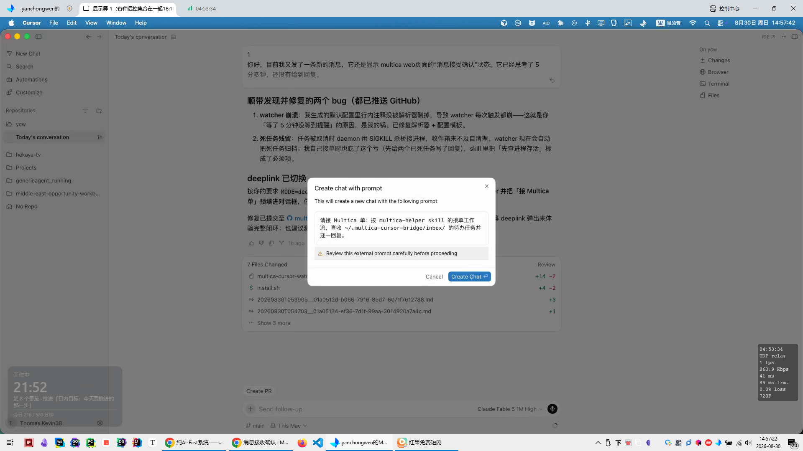

- 资料
	- 已存储在GitHub仓库：     hanshou101/multica-cursor-bridge    https://github.com/hanshou101/multica-cursor-bridge
		- 介绍：
			- 让 Cursor GUI 里的 AI 助手成为 Multica 工作区里的一个原生 agent：可被派单、可被 @、以 agent 身份留痕回复——通过本地桥接实现「人机接力」。
			- 盯单 watcher
				- 非默认开启，强烈推荐。 由 launchd 常驻（与 Cursor 是否运行无关），inbox 有变化立即触发、每 5 分钟兜底扫描，防重复（状态文件记录提醒时间）、防并发（文件锁）、自动忽略已死任务。

- 测试图片：
	- 1
		- 
	- 2
		- 

